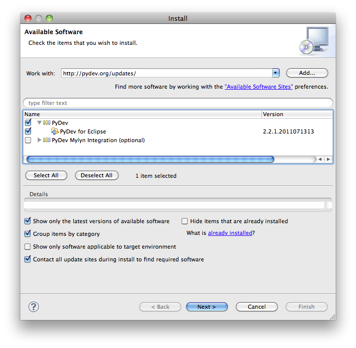
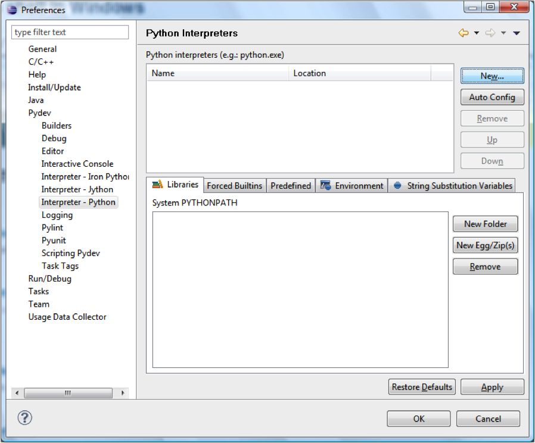

.. _eclipse:

Eclipse
=========

Download and installation
___________________________

Eclipse is written in Java and requires that a Java Runtime Environment (JRE) be installed on your machine to run. If you have any trouble running Eclipse, there might not be an appropriate JRE installed on your machine. You can download one from this `page <http://www.oracle.com/technetwork/java/javase/downloads/index.html>`_. Look for "Download JRE" and follow all necessary steps. If you install a JRE, make sure to remember its architecture (32bit/64bit) and pick the corresponding Eclipse version below.

.. note::

    In recent versions of MacOS, you need to work a bit harder. First you need the Java Development Kit from `here <http://www.oracle.com/technetwork/java/javase/downloads/index.html>`_. 

    After downloading Eclipse and copying it to your Applications folder, open ``/Applications/eclipse/Eclipse.app/Contents/MacOS/eclipse.ini`` and look for the line starting with ``-Dosgi.requiredJavaVersion``. Replace that line with the following three lines::

        -vm
        /Library/Java/JavaVirtualMachines/jdk1.7.0_45.jdk/Contents/Home/bin/java
        -vmargs
        -Dosgi.requiredJavaVersion=1.7

For installing Eclipse, go to the `download section <http://www.eclipse.org/downloads/>`_ of the `Eclipse homepage <http://www.eclipse.org/>`_ and get the version for C/C++ developers for your system (if you're into Fortran / high performance computing, you may also get the parallel applications version). Unpack it, move the entire folder to ``C:\`` (on the Mac: the Applications folder), and make a shortcut to the application eclipse that you find in the folder on your desktop (or wherever you like).

.. image:: eclipse_download.png
   :width: 12cm

Start Eclipse. The first thing you need to pick is a workspace. Eclipse has a hierarchical internal structure and you will only be able to create projects in or below this directory. Try to pick or create one that does not contain any spaces -- in theory it shouldn't matter, but you never know... E.g., if you have all your projects on ``D:\``, just pick that:

.. image:: eclipse_startup.png
   :width: 12cm

.. _pydev_configuration:

Configuration of PyDev
___________________________

Make sure you :ref:`installed Python <python>` before you proceed. Open Eclips and go to `Help -> Install new software` in the menu bar. In the address bar, type ``http://pydev.org/updates``. Expand the triangle next to `PyDev` and tick the box next to `PyDev for Eclipse`:

Click on `Next` as required, accept the license terms, click on `Finish`, trust all certificates, and agree to restart Eclipse.

Now we need to tell Eclipse where to find the Python interpreter. In the Eclipse menu bar, go to `Window -> Preferences` and select `PyDev -> Interpreter - Python`

Click on `New...`, name the interpreter "Anaconda Python 3.3", and click on browse. Go to the place where you installed Anaconda, move on to the subdirectories ``envs`` and  ``py33``, select ``python.exe`` (on Windows, else it will be ``python3`` in the ``bin`` subdirectory):

.. image:: pydev2.png
    :width: 12cm

After clicking okay, you will be asked about the SYSTEM pythonpath. Accept the default, click okay twice. Done.

